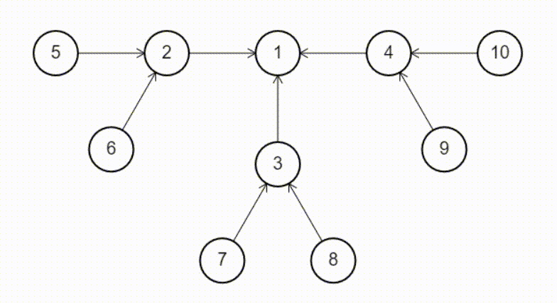

	

## Implementation of Raymond's tree based algorithm for Distributed Mutual Exclusion

[Live Demo](https://ankurparihar.github.io/projects/DME-raymond)

### Mutual Exclusion

> Concurrent access of processes to a shared resource or data is executed in mutually exclusive manner. Only one process is allowed to execute the critical section (CS) at any given time.

In other terms, various running processes that have access to shared resource or data should be able to access them in a way such that only one process at a time is working on it.

- In our simulation, processes are represented as nodes.
- The work is called `executing critical section (CS)`
- Node who has the TOKEN, has the privilege to execute CS.
- Messege passing is used to implement distributed mutual exclusion.

### About

This was an course project in [CSN-232 Operating Systems](https://ankurparihar.github.io/res-iitr?tab=4-1) in which we had to implement an OS based algorithm

The research paper: [Raymond's tree based algorithm.pdf](./papers/Raymond's%20tree%20based%20algorithm.pdf)

### Other Contributors

- [Tarun Kumar](https://github.com/tk565134)
- [Priyesh Kumar](https://github.com/16priyesh)

:warning: C++ version is deprecated as it is single threaded. Javascript version uses asynchronous functions like `setTimeout` and `setInterval` and `async` function calls to achieve an exact simulation
